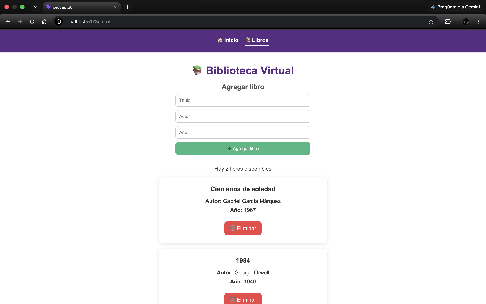
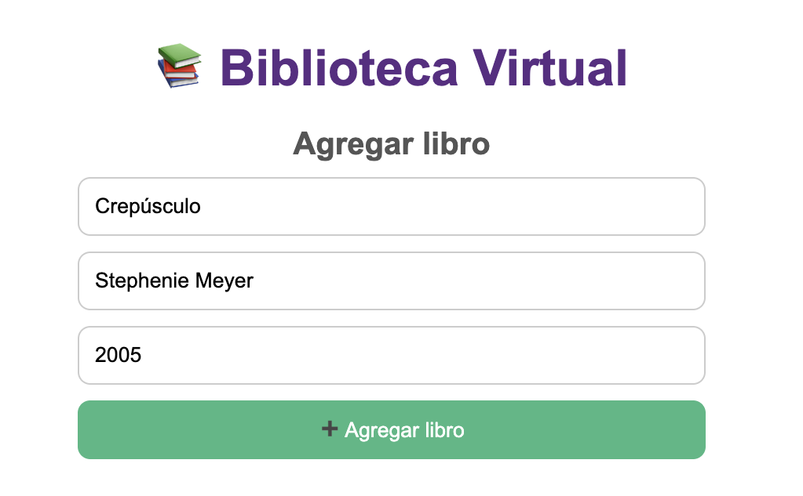
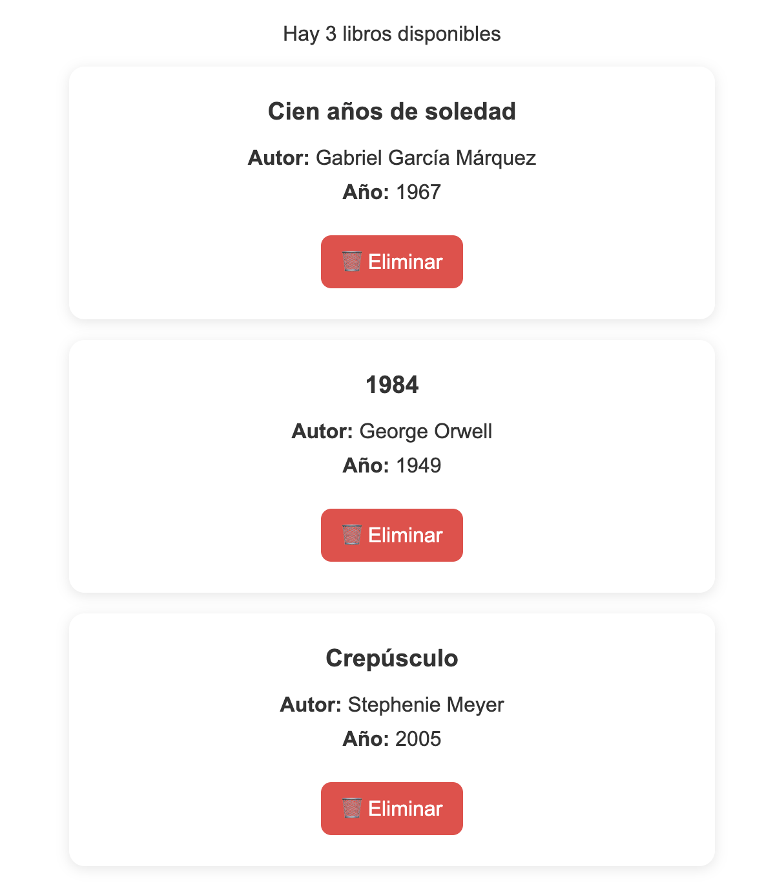
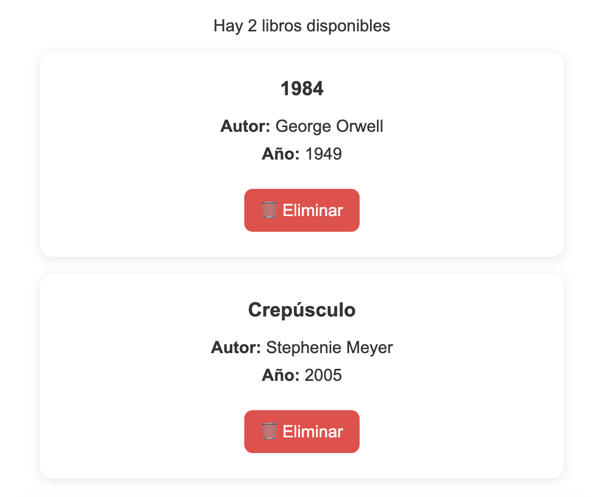

# Proyecto Módulo 6 – BookList SPA (Gestor de Libros)

## 📖 Descripción
Este proyecto corresponde a la evaluación del **Módulo 6** del curso.  
La aplicación es una **SPA (Single Page Application)** desarrollada con **Vue.js** para la **Editorial Nova**, la cual permite gestionar un catálogo interactivo de libros (agregar, listar, eliminar y ver detalles) con una navegación fluida entre pantallas.

## 🛠️ Funcionalidades
- **Estructura Reactiva**: Implementación de Vue 3 con patrón MVVM y enlace reactivo de datos (`v-model`, `v-bind`).
- **Gestión de Libros**: Formulario dinámico para agregar libros con título, autor, categoría y descripción.
- **Listado e Interacción**: Visualización reactiva mediante directivas (`v-for`, `v-if`, `v-show`) y eliminación de elementos (`@click`).
- **Eventos de Teclado**: Soporte para agregar libros al presionar la tecla `Enter` y uso de modificadores de eventos.
- **Navegación SPA (Vue Router)**: Configuración de rutas estáticas y dinámicas (`/`, `/libros`, `/libros/:id`) para visualizar detalles individualizados.
- **Diseño Responsivo**: Interfaz fluida y amigable adaptada al usuario.

## 🧰 Tecnologías utilizadas
- Vue 3
- Vite
- Vue Router
- HTML5
- CSS3
- JavaScript

## 📂 Estructura del proyecto
```text
src/
├── assets/
│   ├── captura-inicio.png
│   └── captura-libros.png
├── components/
│   └── Libro.vue
├── views/
│   ├── Inicio.vue
│   ├── ListaLibros.vue
│   └── DetalleLibro.vue
├── router/
│   └── index.js
├── App.vue
└── main.js
```

## ⚙️ Instalación
 
Clonar el repositorio:
 
```bash
git clone (https://github.com/gdiazcontreras/evaluacion-m6)
```
 
Ingresar al proyecto:
 
```bash
cd evaluacion-m6
```
 
Instalar dependencias:
 
```bash
npm install
```
 
Iniciar servidor de desarrollo:
 
```bash
npm run dev
```

## 🌐 Repositorio
El proyecto está publicado en GitHub:  
👉 [Ver repositorio](https://github.com/gdiazcontreras/evaluacion-m6)

## 🚀 Deployment
El proyecto está desplegado en GitHub Pages:  
👉 [Ver aplicación](https://gdiazcontreras.github.io/evaluacion-m6)

## 📸 Capturas
- Página de inicio 


- Biblioteca


- Ejemplo de **escritura de datos** para añadir libro a la biblioteca.


- Ejemplo de libro **añadido** exitosamente a la biblioteca.


- Ejemplo de libro **eliminado** exitosamente de la biblioteca.


## 👩‍💻 Autora
Proyecto realizado por **Gabriela Díaz Contreras**.

## 🤖 Apoyo con IA
Durante el desarrollo de este proyecto utilicé herramientas de Inteligencia Artificial (Copilot y Gemini) como apoyo para:
- Revisar errores de lógica en el código.
- Ordenar y estructurar mejor las funciones y archivos.
- Revisar el proyecto siguiendo los parámetros entregados en la consigna.
- Crear y dar forma al archivo README.md.

El trabajo final y las decisiones de implementación fueron realizadas por mí, utilizando la IA como guía y apoyo en el proceso.